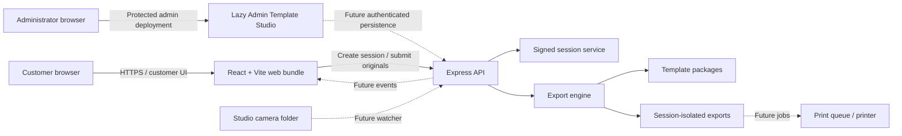
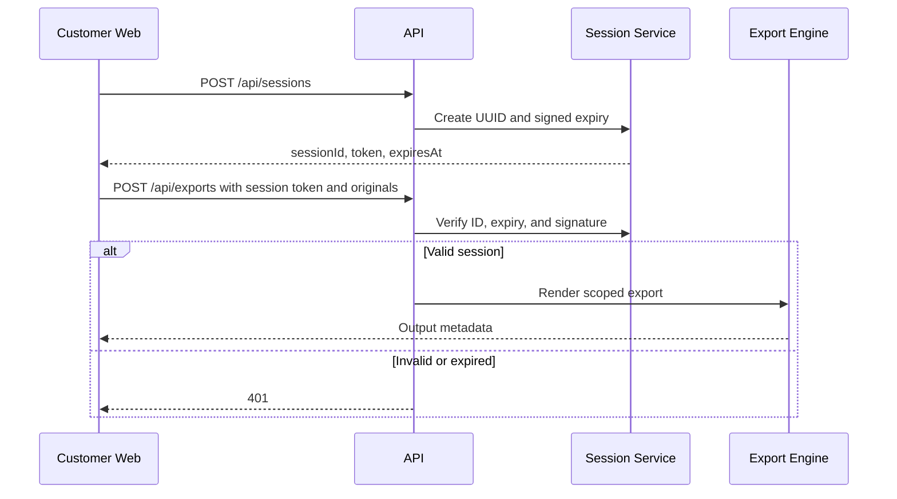
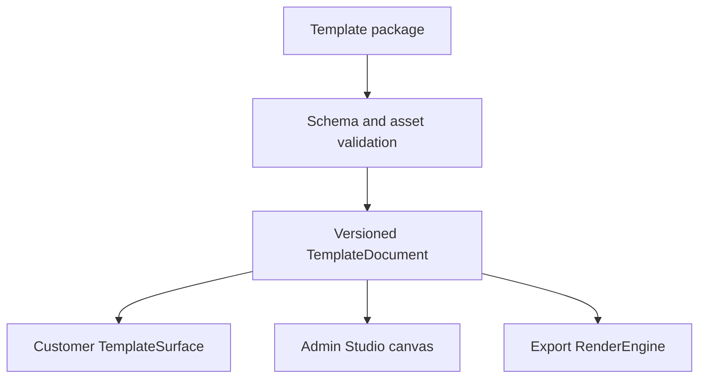
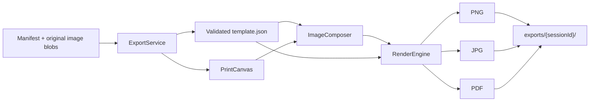
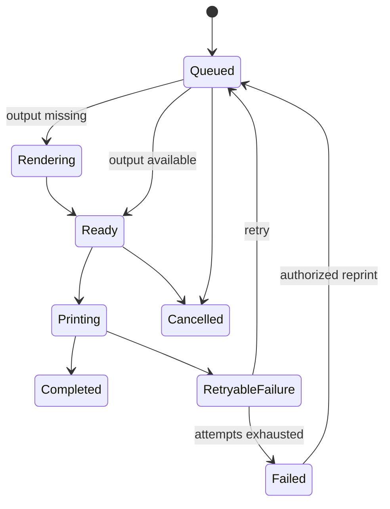
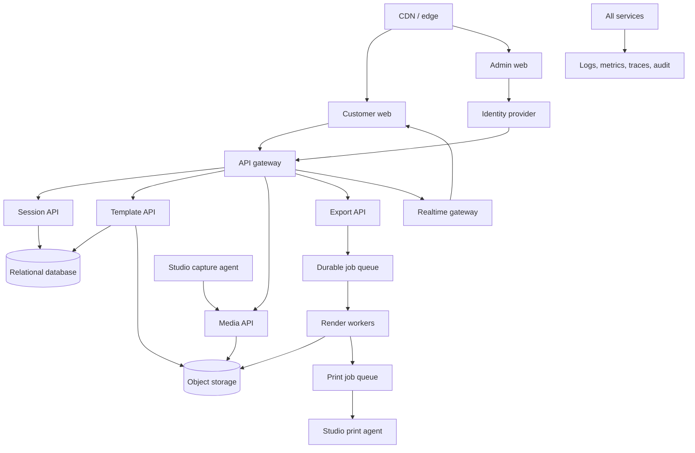

# SelfBooth Architecture

## 1. Scope and Principles

SelfBooth is a session-oriented public web platform with separate customer and administrator surfaces. The current repository is deployable as a Node.js application with local template and export storage. The architecture deliberately leaves clear boundaries for future capture, cloud storage, authentication, QR handoff, and printing services.

Core principles:

- Isolate all customer-owned data by session ID.
- Treat the customer web, admin web, API, render engine, storage, and future workers as separate concerns.
- Keep template documents versioned and independent of React component branches.
- Render output from original source media rather than browser preview pixels.
- Authenticate and authorize every privileged server mutation once admin persistence is introduced.
- Make asynchronous operations idempotent and observable.

## 2. Current System Context



Solid arrows describe current paths. Dashed arrows describe planned integrations.

## 3. Customer Web

The customer web is a React application under `client/src/`. It is mobile-first and owns presentation, template choice, photo-source interaction, non-destructive transform metadata, preview, and export request preparation.

Primary boundaries:

- `CustomerApp.tsx` coordinates the customer application flow.
- `pages/` contains route-level customer screens.
- `components/editor/` owns interactive photo-frame behavior.
- `components/template/` renders versioned template documents.
- `services/export/` translates browser state and original blobs into the API contract.
- `SessionProvider` obtains and exposes a signed customer session.
- `BrandingProvider` supplies white-label presentation values.

The customer browser may hold temporary object URLs and composition state, but it must not be considered authoritative persistent storage. A future synchronization layer should persist only scoped, validated domain state.

## 4. Admin Web

The Admin Template Studio lives under `client/src/features/admin/` and reuses the shared template document and renderer. It is lazy-loaded when an admin route is requested and enabled only in builds configured with `VITE_APP_ROLE=admin`.

Current capabilities include a dashboard, template list, visual editor, layers, history, local drafts, live preview, and package downloads. Browser storage is a temporary persistence mechanism.

The build-time role gate prevents the customer deployment from exposing the studio, but it is not an authorization boundary. Before templates can be stored centrally, the API must validate an administrator identity and permission on every read and mutation. Production should deploy the admin surface behind an identity-aware gateway or equivalent defense in depth.

## 5. API

The Node.js/Express service is the current process boundary for trusted operations.

Current endpoints:

| Endpoint | Purpose |
| --- | --- |
| `POST /api/sessions` | Issue a new signed customer session |
| `POST /api/exports` | Validate a session and generate an output file |
| `GET /api/health` | Basic process health |

The API applies security headers, rate limits, explicit origin handling, upload limits, and input/path validation. Socket.IO is initialized as a future real-time transport but does not currently carry business events.

Future API design should separate HTTP transport from application services and infrastructure adapters. Long-running export, watcher, and print work should move to durable queues rather than occupy request lifecycles.

## 6. Storage

### Current storage

```text
templates/{templateId}/
├── template.json
├── background.png
└── thumbnail.png

exports/{sessionId}/{safeFilename}-{timestamp}.{format}
```

Template packages are committed source assets and discovered during the frontend build. Export output is written below a validated session directory. Camera input is reserved under `photos/` but not yet watched.

### Storage invariants

- Resolve and validate paths against an explicit root.
- Reject traversal and untrusted filenames.
- Never mix session-owned media between directories or storage prefixes.
- Treat uploaded media and template assets as untrusted input.
- Define retention and deletion policies before production photo ingestion.
- Use immutable object keys or content versions for published template assets.

For horizontally scaled deployments, local exports must be replaced by shared persistent storage or an object-storage adapter.

## 7. Session Architecture

The current `SessionService` issues a UUID, expiration time, and HMAC signature. Verification is stateless and uses timing-safe comparison. The configured lifetime is 12 hours.



The token proves that the API issued the session; it does not yet provide revocation, cross-device membership, ownership records, or QR handoff. Those features require a durable session model with participant and lifecycle state.

## 8. Template Engine

`TemplateDocument` is the shared, versioned layout contract. It defines canvas size, assets, background color, ordered photo slots, dynamic variables, and administrator-created elements. Slot and element positions use template canvas coordinates, which allows arbitrary layouts without hardcoded rendering cases.

Template package rules:

- `schemaVersion` identifies the parser and migration path.
- `id` is stable and safe for storage paths.
- Geometry must remain inside canvas boundaries.
- Stacking is controlled by `zIndex` and document order.
- Assets are referenced by package-local names or future managed asset IDs.
- Published templates should be immutable versions; edits should create a new revision.



The current client model contains newer administrator element fields than the server export template contract. Before publishing these elements to production output, both sides need one canonical schema, versioned validation, and rendering parity tests.

## 9. Export Engine

The export engine is split into four modules:

- `ExportService` validates manifests, loads templates, constrains paths, and persists results.
- `PrintCanvas` converts physical dimensions and bleed to 300-DPI pixel geometry.
- `ImageComposer` crops, scales, rotates, masks, and positions original images.
- `RenderEngine` composites the print and encodes PNG, JPG, or PDF.



The preview canvas is never used as an export source. The client submits original blobs plus transform metadata, and the server reconstructs the composition.

Production evolution should make export creation asynchronous, introduce idempotency, persist status, store inputs and outputs durably, and add golden-image tests.

## 10. Print Queue

The production print queue is persisted in Supabase. A customer Room session creates one draft `print_orders` record protected by an opaque edit token. Each completed Template is rendered once in the browser, downloaded to the customer device, uploaded as PNG to the `print-orders` Storage bucket, and registered as one `print_order_items` row. PostgreSQL stores only object metadata and paths.

Drafts are hidden from Admin until the customer submits once. Submission locks item mutations and exposes the order as `Pending`. Admin reads the shared queue newest-first, previews or downloads stored images, creates ZIP downloads in the browser, advances the status through `Pending`, `Printing`, `Completed`, or `Cancelled`, and can delete an order with its objects. Repository interfaces isolate React pages from the Supabase adapter.

Recommended state model:



Jobs need durable state, an idempotency key, printer/media profile, attempt history, operator audit data, and bounded retry rules. Printer communication belongs behind an adapter so Windows spooler, CUPS, vendor SDK, or remote studio agent implementations do not leak into application logic.

## 11. Future Cloud Architecture



Recommended production characteristics:

- Stateless API replicas behind an ingress or load balancer.
- Relational records for studios, users, sessions, templates, revisions, exports, and print jobs.
- Object storage for original photos, template assets, and rendered output.
- Durable queues for rendering and printing.
- Short-lived signed URLs and tenant/session-prefixed object keys.
- Identity provider and role-based authorization for administrators and operators.
- A studio-side agent for camera watching and local printer access.
- Central logs, metrics, traces, alerts, and audit events.
- Explicit retention, privacy, backup, disaster-recovery, and regional-data policies.

## 12. Security and Multi-Tenancy

Session IDs are the current customer isolation key. Future cloud records must also include a studio or tenant ID, and every query, object key, queue message, and audit event must carry the relevant scope. Client-supplied scope values are never sufficient authorization on their own.

Administrator mutations require server-side authentication and role checks. Uploads require type, size, decoding, and path validation. Template SVG and text content require sanitization before browser or server rendering. Secrets must be injected at runtime and rotated without source changes.

## 13. Architectural Decision Rules

- Record material changes to contracts, persistence, security, or deployment in this document or a dedicated ADR.
- Prefer backwards-compatible schema evolution; introduce a new `schemaVersion` for breaking template changes.
- Keep infrastructure implementations behind interfaces owned by the application domain.
- Do not make the browser authoritative for permissions, job state, or durable assets.
- Require parity tests whenever client preview and server print rendering interpret the same document.
